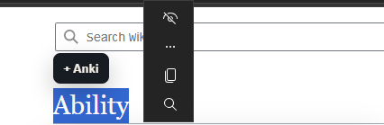
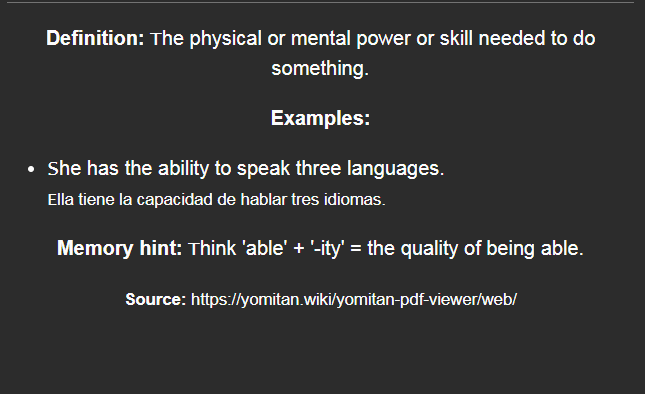
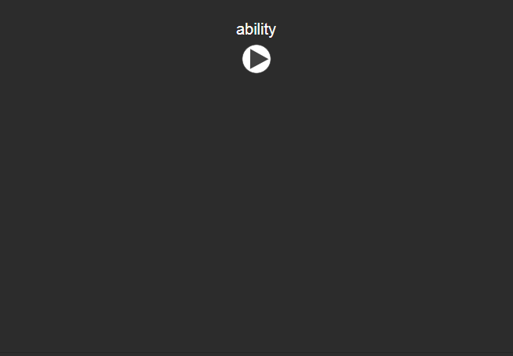
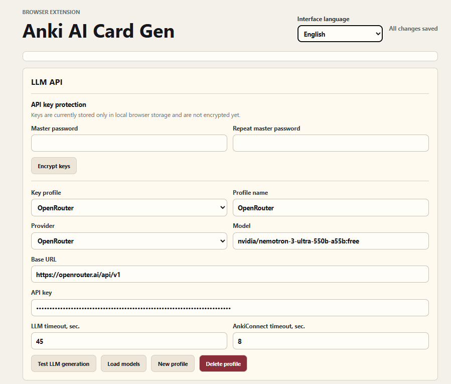
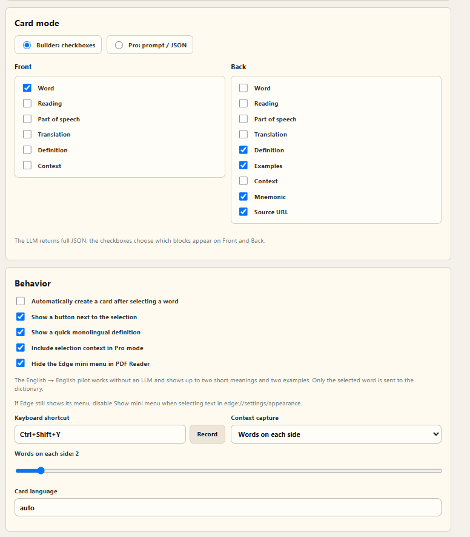

# Anki AI Card Gen

Browser extension for Google Chrome and Microsoft Edge. Select exactly one word on any page, send that word plus surrounding context to an LLM, generate a flashcard, and add it to Anki through AnkiConnect.

## Features

- Automatic card generation after selecting a word.
- Floating `+ Anki` button near the selection.
- Selection context menu.
- Edge Immersive Reader fallback through the selection context menu.
- Built-in PDF reader powered by Mozilla PDF.js, with continuous scrolling, lazy page rendering, selectable text, drag and drop, page navigation, and zoom.
- `Open PDF Reader` button in the extension popup; an active remote PDF is opened automatically.
- Fast English-to-English dictionary popup with concise meanings and up to two examples, without an LLM request.
- Popup button for explicit debug-friendly creation from the current selection.
- Browser fallback shortcut: `Alt+Shift+A`.
- In-extension custom keyboard shortcut binding for pages where content scripts run. Default: `Ctrl+Shift+Y`.
- Context capture by word window or sentence punctuation.
- Two card modes: Builder with checkboxes, or Pro with prompt/JSON control.
- Multiple LLM API key profiles.
- Optional AES-GCM encryption for API keys with a master password.
- Automatic settings saving; there is no separate Save button.
- Configurable `Base URL`, model, and prompt.
- Provider presets for OpenRouter, OpenAI, Groq, Together AI, DeepSeek, Mistral AI, Google Gemini, local Ollama, and custom OpenAI-compatible endpoints.
- Live model list loading from providers that expose the OpenAI-compatible `/models` endpoint.
- Configurable Anki deck, note type, `Front` and `Back` fields, and tags.
- Live Anki dropdown suggestions for decks, note types, and fields.
- Configurable LLM and AnkiConnect timeouts.
- Russian and English settings/popup localization with browser-language auto detection.
- Per-site blocklist and reverse allowlist modes, including a quick current-site toggle in the extension popup.
- Works in Chromium-based Microsoft Edge as an unpacked extension.

## Screenshots

### Website → card front → card back

| 1. Select a word on a website | 2. Card front | 3. Card back |
| --- | --- | --- |
|  |  |  |

### Settings

#### LLM provider and API key profiles



#### Card layout and selection behavior



## Install in Microsoft Edge

1. Install Anki.
2. Install the [AnkiConnect](https://ankiweb.net/shared/info/2055492159) Anki add-on.
3. Open Anki so AnkiConnect listens on `http://127.0.0.1:8765`.
4. Open `edge://extensions` in Microsoft Edge.
5. Enable Developer mode.
6. Click Load unpacked.
7. Select this project folder.
8. Open the extension options, add your API key, protect it with a master password, and run the AnkiConnect test.

## Install in Chrome

1. Install Anki.
2. Install the [AnkiConnect](https://ankiweb.net/shared/info/2055492159) Anki add-on.
3. Open Anki so AnkiConnect listens on `http://127.0.0.1:8765`.
4. Open `chrome://extensions` in Chrome.
5. Enable Developer mode.
6. Click Load unpacked.
7. Select this project folder.
8. Open the extension options, add your API key, protect it with a master password, and run the AnkiConnect test.

## LLM Settings

The default endpoint is OpenRouter-compatible:

```text
https://openrouter.ai/api/v1
```

You can add multiple API key profiles and switch between them. For OpenAI-compatible providers, set `Base URL` to the API root, for example:

```text
https://api.openai.com/v1
```

The provider selector fills a compatible base URL and a practical default model. Existing custom profiles continue to work and are migrated by detecting their saved base URL. Use `Load models` to query the active provider instead of relying on a hard-coded model list. Ollama can be used locally without an API key.

The extension appends `/chat/completions` automatically when the full endpoint is not provided.

Use Check LLM key in the options page after editing a profile. The test sends a tiny chat request and reports whether the key, base URL, and model are accepted. If a model is slow, raise the LLM timeout or switch to a faster model.

Settings are saved automatically after a short pause. The status next to the page title confirms when persistence is complete.

## API Key Protection

The settings page can migrate all existing LLM profiles into an encrypted vault. The vault uses AES-GCM; its key is derived from the master password with PBKDF2-SHA256. Only encrypted profile data is kept in persistent browser storage. The unlocked key is kept in browser session storage and is cleared when the browser closes.

After restarting Chrome or Edge, open the extension settings and unlock the vault before creating a card. The master password cannot be recovered by the extension, so keep it in a password manager.

## PDF Reader

Click `Open PDF Reader` in the popup. If the active tab points directly to an HTTP or HTTPS PDF, the reader loads it automatically. Otherwise use `Open PDF` or drag a local PDF onto the reader.

The reader displays pages in one continuous vertical stream and lazily renders nearby pages to keep long documents responsive. It also supports page jumps, fit-to-width and manual document zoom. The reader interface remains at 100%; `Ctrl + mouse wheel`, `Ctrl + +/-`, and `Ctrl + 0` scale only the PDF. Its text layer is selectable, so the floating `+ Anki` button, automatic creation, custom shortcut, and configurable context capture work in the reader just like on a normal web page. Only one selected word is sent as the card term; nearby PDF text is sent separately as context.

The reader remembers the last open PDF and the current position inside its page. Remote documents are restored from their URL. The most recently opened local PDF is stored in the extension's local IndexedDB storage so it can be reopened without asking for the file again.

The `Без меню Edge` checkbox attempts to suppress the Edge selection mini menu inside the reader and is synchronized with the extension settings. Edge ultimately owns this browser-level menu; if it still appears, disable `Show mini menu when selecting text` in `edge://settings/appearance`.

The optional quick dictionary popup uses FreeDictionaryAPI.com data sourced from Wiktionary. It sends only the selected word, never the surrounding page context. It shows up to two concise English definitions and two examples, caches successful lookups locally for 30 days, and times out independently from card generation. The pilot mode is English-to-English; other source languages remain disabled because the current provider returns English glosses for them rather than same-language definitions. Dictionary content is available under CC BY-SA and the popup links back to its Wiktionary source.

Password-protected PDFs are not supported in this version. PDF.js is bundled locally under its Apache 2.0 license; no document is uploaded to a third-party reader service.

## Prompt

The card settings have two modes:

- Builder: choose which JSON blocks appear on the Anki front and back with checkboxes.
- Pro: edit the prompt and expected JSON behavior directly.

In both modes the LLM returns the same normalized JSON shape; the mode controls how the Anki card is rendered.

The prompt supports these variables:

- `{{word}}` - exactly one selected word.
- `{{context}}` - short text fragment around the selection.
- `{{language}}` - target language from the options page.

The LLM should return strict JSON. If you edit the prompt, keep the default response shape or compatible fields: `term`, `reading`, `partOfSpeech`, `translation`, `definition`, `examples`, `mnemonic`, `tags`.

## Anki

The default setup targets Anki note type `Basic` with fields `Front` and `Back`. For custom Anki note templates, enter the exact field names in the extension options.

When Include context is enabled, the selected page context is added to the back of the card and the selected term is highlighted.

## Selection Context

The options page has two context capture modes:

- Words around selection: capture a configurable number of words on the left and right.
- Sentence punctuation: capture text until nearby sentence-ending punctuation.

The context is also sent to the LLM through `{{context}}`, so custom prompts can use the real surrounding sentence.

Only the selected single word is used as the card term. If the user selects a sentence or a multi-word phrase, the extension rejects it instead of creating a sentence card.

Use Check Anki settings before generating cards. The extension validates that:

- AnkiConnect is reachable.
- The configured deck exists.
- The configured note type exists.
- The configured `Front` and `Back` fields exist on that note type.

The extension checks Anki before calling the LLM, so a broken Anki setup will not spend API tokens.

Use `Load lists from Anki` while Anki is open to populate dropdown suggestions for decks, note types, and fields. Selecting another note type refreshes its field suggestions. Manually typed values are still supported for unusual Anki setups.

## Site access

Site rules support two modes:

- Blocklist: the extension works everywhere except matching sites.
- Allowlist: the extension works only on matching sites.

Add one rule per line. `example.com` includes its subdomains, while `example.com/private/*` limits a rule to a path. Rules are enforced by both the page script and the background worker, including keyboard shortcuts, the context menu, the quick dictionary, and card creation. The extension popup can add or remove the current hostname from the active rule mode.

## Edge Notes

Microsoft Edge supports this extension through the Chromium extension APIs used in `manifest.json`. If the keyboard shortcut does not trigger, open `edge://extensions/shortcuts` and assign the shortcut manually.

The custom shortcut in the extension options works on ordinary web pages after the page has been reloaded. Browser-internal pages such as `edge://extensions` and `chrome://extensions` do not allow content scripts.

Edge Immersive Reader is a browser-controlled surface. Content scripts and in-page floating buttons may be unavailable there. For PDFs, use the built-in Anki PDF Reader from the extension popup. For other Reader pages, the selection context-menu fallback may still work, but surrounding context can be unavailable.

## Debug Checklist

- Reload the target web page after loading or reloading the unpacked extension.
- The extension cannot run content scripts on browser pages like `edge://extensions`, `chrome://extensions`, or the web store.
- For reliable PDF selection in Edge, use the built-in PDF Reader rather than the system PDF viewer or Immersive Reader.
- If encrypted API profiles are locked after a browser restart, unlock them in the extension settings.
- Keep Anki open while generating cards.
- Run Check LLM key and Check Anki settings from the options page.
- If generation starts but never finishes, lower the model latency or increase the LLM timeout in options.
